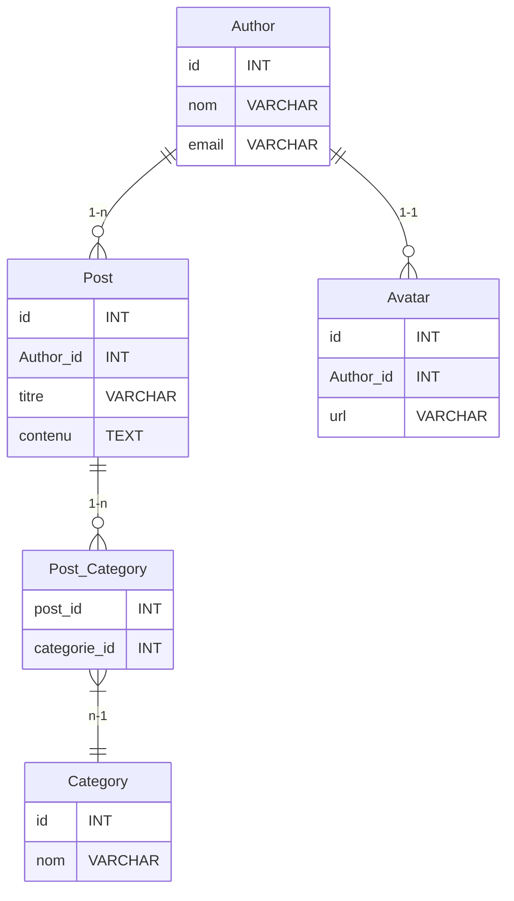

Je m'excuse pour cela. Voici la question manquante avec la réponse correcte cochée :

### QCM sur le Modèle Relationnel et les Contraintes d'Intégrité SQL

#### Modèles de données :
- **Author** : (id, nom, email)
- **Post** : (id, titre, contenu, author_id)
- **Category** : (id, nom)
- **Avatar** : (id, url, author_id)
- **Post_Category** : (post_id, categorie_id)

### Questions :

1. **Quelle contrainte d'intégrité est utilisée pour définir la relation entre `Author` et `Post` ?**
   - [x] A. Foreign Key
   - [ ] B. Primary Key
   - [ ] C. Unique Key
   - [ ] D. Check Constraint

2. **Quelle relation existe entre `Author` et `Post` ?**
   - [ ] A. Un à un (one to one)
   - [ ] B. Plusieurs à plusieurs (many to many)
   - [ ] C. Plusieurs à un (many to one)
   - [x] D. Plusieurs à un (one to many)

3. **Que signifie la contrainte `ON DELETE CASCADE` dans une relation `Foreign Key` ?**
   - [x] A. Lorsqu'un enregistrement est supprimé, les enregistrements dépendants (table propriétaire) sont également supprimés.
   - [ ] B. Les enregistrements dépendants ne peuvent pas être supprimés.
   - [ ] C. Les enregistrements dépendants sont mis à jour.
   - [ ] D. Lorsqu'un enregistrement est supprimé, les enregistrements dépendants (table propriétaire) sont également mis à null.

4. **Quelle contrainte serait appropriée pour la relation `Post` et `Category` dans la table propriétaire ?**
   - [x] A. Foreign Key
   - [ ] B. Primary Key
   - [ ] C. Unique Key
   - [ ] D. Aucun des choix

5. **Dans une relation `many to many` entre `Post` et `Category`, quelle table intermédiaire est nécessaire ?**
   - [x] A. Post_Category
   - [ ] B. Post_Cat
   - [ ] C. Cat_Post
   - [ ] D. Aucun des choix

6. **Quelle contrainte d'intégrité autre qu'une FK serait utilisée pour la relation un à un entre `Author` et `Avatar` dans la table propriétaire l'une ou l'autre dans ce cas ?**
   - [ ] A. Foreign Key
   - [ ] B. Une deuxième Primary Key dans une des deux tables
   - [x] C. Unique Key
   - [ ] D. Check Constraint

7. **Quelle est la clé primaire, recommandée, dans la table `Post_Category` ?**
   - [ ] A. post_id
   - [ ] B. categorie_id
   - [x] C. post_id et categorie_id (composite key)
   - [ ] D. Aucun des choix

8. **Que fait la contrainte `ON DELETE SET NULL` ?**
   - [ ] A. Met à jour les enregistrements dépendants (table propriétaire).
   - [ ] B. Définit les clés étrangères des enregistrements dépendants (table propriétaire) à NULL.
   - [ ] C. Supprime les enregistrements dépendants.
   - [ ] D. Empêche la suppression des enregistrements parents.

9. **Quelle relation est correcte pour `Post` et `Category` dans notre projet ?**
   - [ ] A. Un à un (one to one)
   - [ ] B. Un à plusieurs (one to many)
   - [x] C. Plusieurs à plusieurs (many to many)
   - [ ] D. Aucun des choix

10. **Dans la table `Post`, quel champ représente une clé étrangère ?**
    - [ ] A. id
    - [ ] B. titre
    - [ ] C. contenu
    - [x] D. author_id

11. **Si un `Author` est supprimé que se passe-t-il dans la table `Post` si il y a des références ?**
    - [ ] A. Les enregistrements dans `Post` sont supprimés.
    - [ ] B. Les enregistrements dans `Post` sont mis à jour avec NULL dans `Author_id`.
    - [ ] C. Les enregistrements dans `Post` ne sont pas affectés.
    - [x] D. On ne peut pas supprimer un `Author` si il y a des références dans la table `Post`

12. **Quel type de relation nécessite une table d'association ?**
    - [ ] A. Un à un (one to one)
    - [ ] B. Un à plusieurs (one to many)
    - [ ] C. Plusieurs à plusieurs (many to many)
    - [ ] D. Aucun des choix

13. **Que se passe-t-il si une contrainte `ON DELETE RESTRICT` est définie sur une clé étrangère ?**
    - [ ] A. Les enregistrements dépendants sont supprimés.
    - [ ] B. Les enregistrements dépendants sont définis à NULL.
    - [x] C. La suppression de l'enregistrement parent est empêchée.
    - [ ] D. Les enregistrements dépendants sont mis à jour.

14. **Dans la relation un à un entre `Author` et `Avatar`, comment s'assure-t-on que chaque `Author` a au plus un `Avatar` ?**
    - [x] A. En utilisant une clé étrangère unique dans `Avatar`.
    - [ ] B. En utilisant une clé primaire dans `Avatar`.
    - [ ] C. En utilisant une clé primaire composite.
    - [ ] D. En utilisant une contrainte CHECK.

